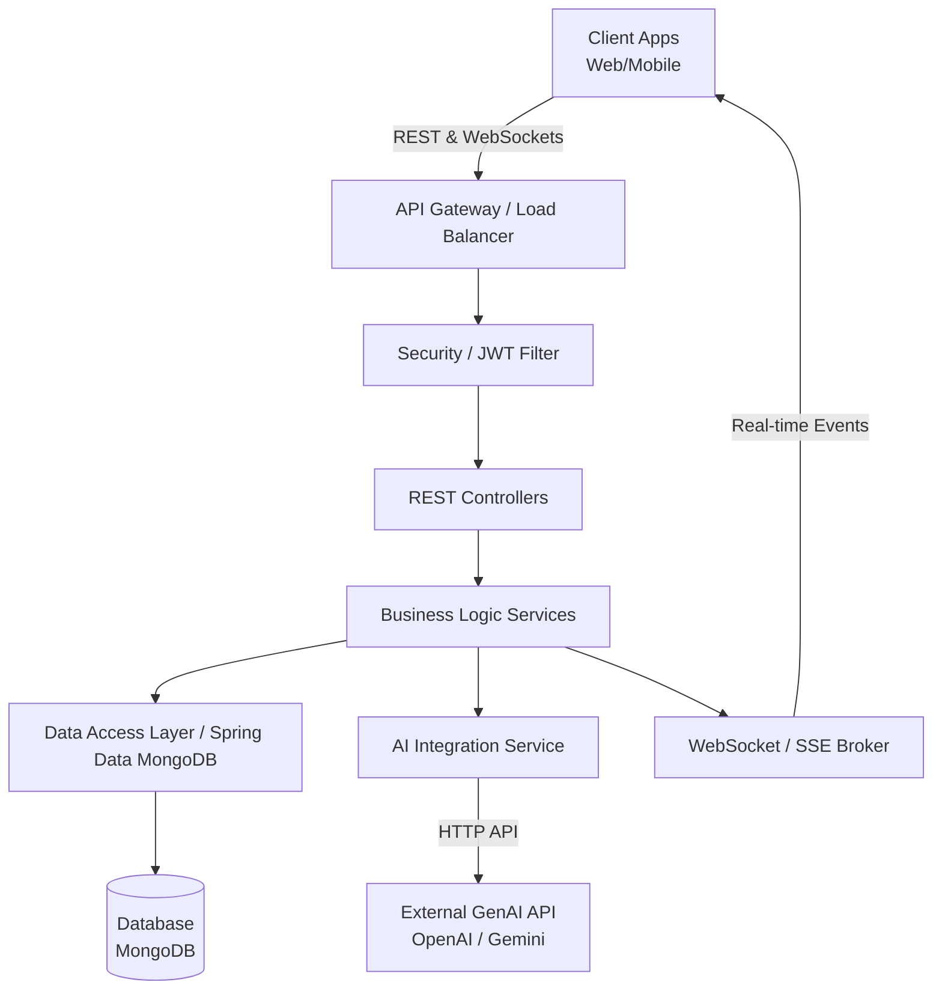
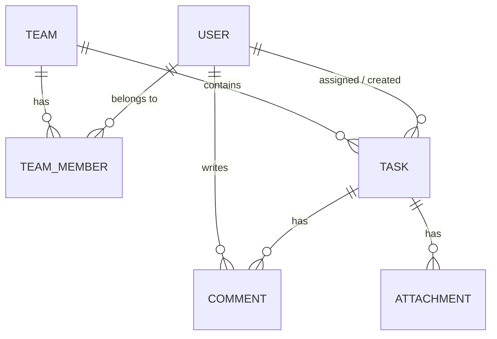

# TaskMaster System Architecture

## 1. High-Level Architecture Overview
TaskMaster follows a standard layered client-server architecture. The backend is built as a RESTful API using **Spring Boot**, communicating with a primary database for persistence, and utilizing WebSockets/SSE for real-time capabilities. It also integrates with a third-party AI service for generative task descriptions.

## 2. Technology Stack
*   **Language:** Java (JDK 17+)
*   **Framework:** Spring Boot 3.x
*   **Dependency Management:** Maven / Gradle
*   **Database:** MongoDB (NoSQL)
*   **Security:** Spring Security + JWT (JSON Web Tokens)
*   **Data Access:** Spring Data MongoDB
*   **Real-time Communication:** Spring WebSockets (STOMP over WebSocket) or Server-Sent Events (SSE)
*   **API Documentation:** OpenAPI / Swagger (SpringDoc)

## 3. Core System Components

### 3.1. Controller Layer
Exposes RESTful endpoints and handles incoming HTTP requests. It delegates business logic to the Service layer and returns appropriate HTTP responses and DTOs (Data Transfer Objects).
*   `AuthController`: Registration, login, token refresh.
*   `UserController`: Profile management.
*   `TaskController`: Task CRUD, filtering, searching, and AI generation triggers.
*   `TeamController`: Team creation, user invitations.
*   `CommentController`: Managing task comments and attachments.

### 3.2. Service Layer
Contains the core business logic of the application.
*   `AuthService`: Validates credentials and generates JWTs.
*   `TaskService`: Handles task assignments, state changes, and validation.
*   `NotificationService`: Triggers real-time events to users when tasks are assigned or updated.
*   `AIGenerationService`: Interfaces with the external generative AI model to create task descriptions.

### 3.3. Repository Layer
Abstracts data access logic using Spring Data. Interacts directly with the underlying database.

### 3.4. Security Filter Chain
Intercepts incoming requests, extracts the JWT from the `Authorization` header, validates it, and sets the authentication context for the request.

## 4. High-Level Data Model (Entity Relationships)
Assuming a Document approach (MongoDB):

*   **User:** `id`, `username`, `email`, `password_hash`, `role`, `created_at`
*   **Team/Project:** `id`, `name`, `description`, `owner_id`, `created_at`
*   **TeamMember (Join Table):** `team_id`, `user_id`, `role_in_team`
*   **Task:** `id`, `title`, `description`, `status`, `due_date`, `assignee_id`, `reporter_id`, `team_id`, `created_at`
*   **Comment:** `id`, `task_id`, `user_id`, `content`, `created_at`
*   **Attachment:** `id`, `task_id`, `user_id`, `file_url`, `file_type`, `created_at`

## 5. Key Integrations

### 5.1. Real-time Notifications
When a task's status changes or it is reassigned, the `TaskService` will publish an event. The `NotificationService` captures this event and pushes a message to the specific user's topic via the WebSocket broker.

### 5.2. AI Task Generation
The client sends a brief prompt to a specific endpoint (e.g., `/api/v1/tasks/generate`). The controller forwards this to the `AIGenerationService`, which constructs a prompt and makes a secure HTTP call to an external LLM provider. The response is parsed and returned to the client to pre-fill the task creation form.
